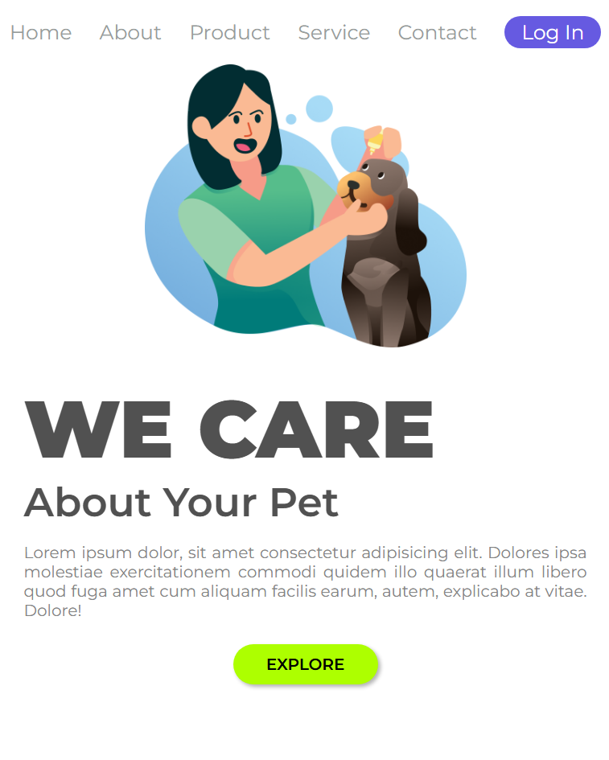
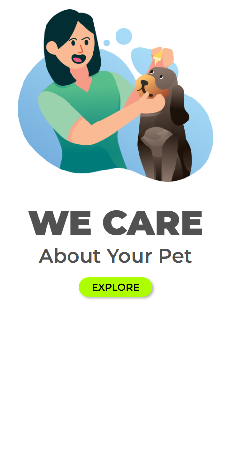

  

<h1 align="center">🐾 Pet Shop Login Screen</h1>

  A modern and user-friendly login screen for a Pet Shop, designed to deliver an excellent user experience.  
  Ideal for study projects, portfolios, and integration with pet management systems.

  
  
  

---

## ✨ Features
- Modern and intuitive design  
- Pet-themed and friendly interface  
- Clean and responsive layout  
- Easy to customize and expand  

---

## 📸 Preview

### 🖥️ Desktop

  

### 💻 Tablet

  

### 📱 Mobile

  

 
 
 
 

## 🚀 Technologies
- HTML5  
- CSS3  

---

## 📂 Project Structure

📁 img  
├─ cute-doggie.gif  
├─ wecare-computer.png  
├─ wecare-ipad.png
└─ wecare-cellPhone.png  
📄 index.html  
📄 styles.css   
 

---

## Live Demo

online website: https://victor-f-padua.github.io/We-Care/

---

## 🤝 Contributing
Contributions, issues, and feature requests are welcome!  
Feel free to fork this repository and submit a pull request.

---

## 📬 Contact
If you have any suggestions or feedback, please get in touch.  
**Thank you for your attention — this is just the beginning! 💪🐶**

